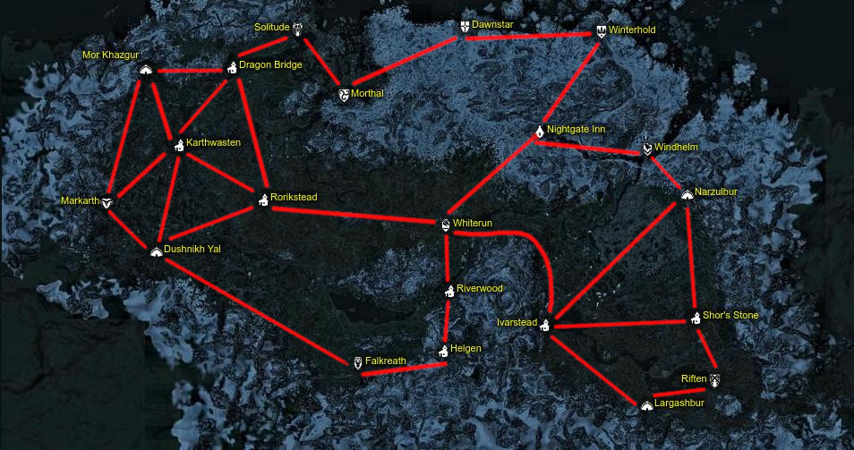
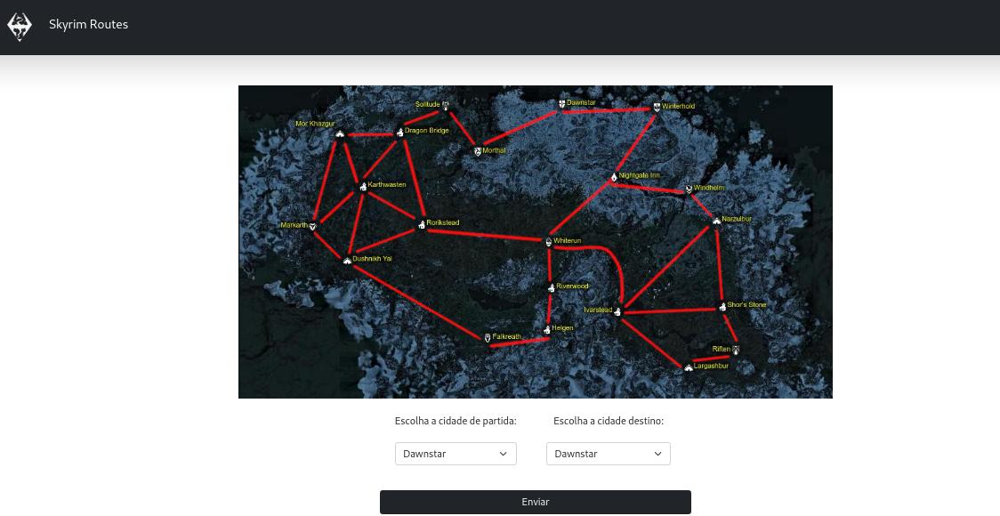
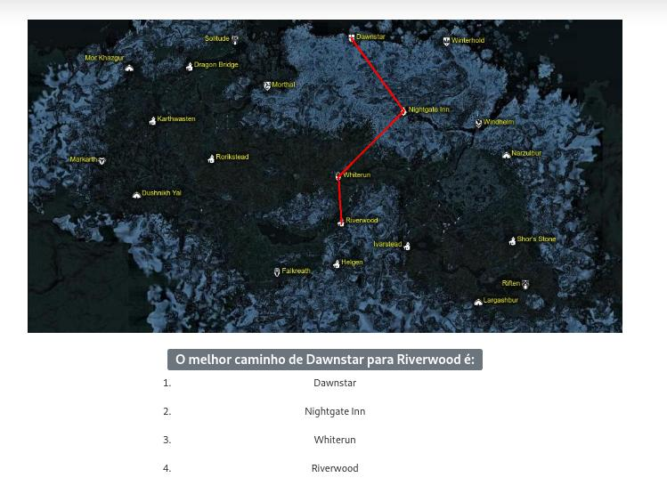

# Grafos2_Skyrim_Routes

**Número da Lista**: X<br>
**Conteúdo da Disciplina**: Grafos2<br>

## Alunos
|Matrícula | Aluno |
| -- | -- |
| 18/0106970  |  Matheus Gabriel Alves Rodrigues |
| 18/0129287 |  Pedro Henrique Vieira Lima |

## Sobre 
O projeto consiste em mostrar a menor rota possível baseado no mapa do famoso game Skyrim. Para tanto será utilizado um grafo não direcionado com pesos,
esses pesos consistem no tempo que se levaria no deslocamento, sempre levando em consideração as possíveis rotas mapeadas e relevo da região.

## Screenshots

### Rotas



### Home do projeto



### Pagina de resultados



## Instalação 
**Linguagem**: Python<br>
**Framework**: Flask<br>
Descreva os pré-requisitos para rodar o seu projeto e os comandos necessários.

## Uso 
``` bash
pip install flask pandas
```

``` bash
python main.py
```
